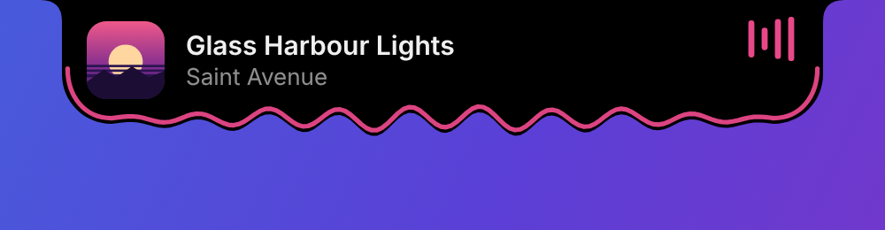
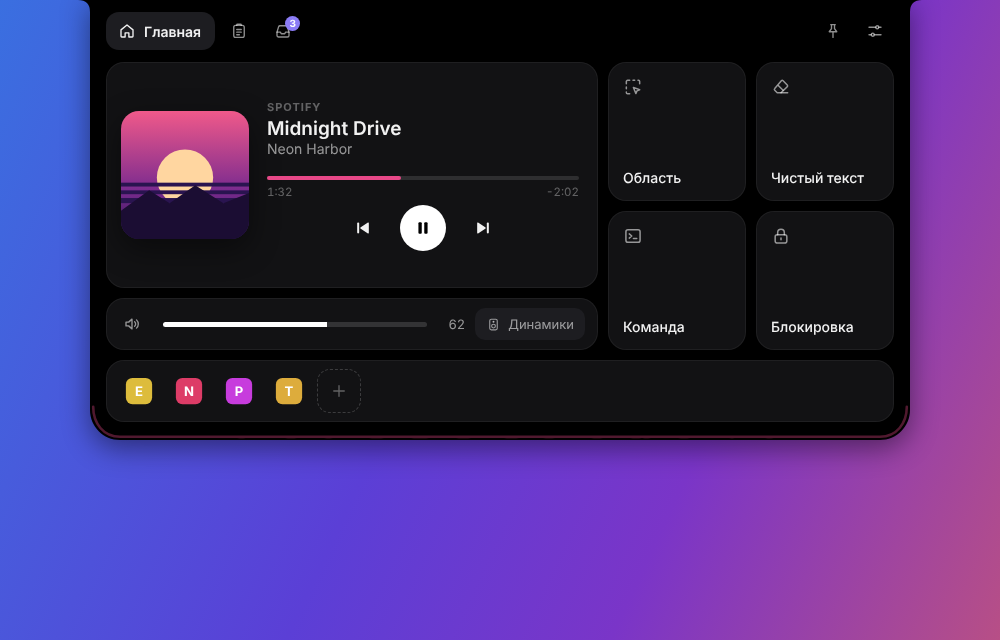

# Island

Жидкий «Dynamic Island» для Windows 10/11. Висит сверху по центру экрана, тянется к курсору, дрожит под музыку и раскрывается при наведении.



Стек: **Tauri 2** (Rust + WebView2) и **React 19 + TypeScript** — установщик весит единицы мегабайт, а не сотни, как у Electron.

## Что умеет

| | |
|---|---|
| **Остров** | Жидкая форма на canvas: пружинная анимация размеров, вытягивание к курсору с отрывом капли, волна по нижнему краю под уровень системного звука, цветной кант под цвет обложки. Прячется в полноэкранных играх и видео. |
| **Музыка** | Любой плеер, который отдаёт данные в Windows (Spotify, Яндекс Музыка, браузеры, Медиаплеер): обложка, название, прогресс с перемоткой, назад/пауза/вперёд, громкость и устройство вывода. При смене трека остров на пару секунд показывает название. |
| **Полка** | Перетащите файл на остров → «На полку». Файлы лежат, пока не понадобятся; карточку можно утащить обратно в любое окно, открыть, показать в папке или скопировать как файл. |
| **В лаунчер** | Вторая зона при перетаскивании: ярлык программы или файла закрепляется в доке на главной и в поиске лаунчера. |
| **Буфер** | История текста, картинок и файлов с источником («chrome · 5 ч»), поиск, закрепление. Клик — вставка прямо в окно, где вы работали. Записи, которые менеджеры паролей помечают как скрытые, не сохраняются. |
| **Лаунчер `Alt+Space`** | Все программы из «Пуска» (включая приложения Store), калькулятор `(1250 + 380) * 1.2`, перевод величин `5 км в милях`, курсы валют `100 usd в рублях`, поиск в Яндексе. Понимает запрос в неправильной раскладке («зщцук» → power). |
| **Главная, 2×4** | Область, Весь экран, Текст с экрана, QR-код, Пипетка, Чистый текст, Запись экрана (Xbox Game Bar), Команда. Блокировка — команда в лаунчере. |
| **Захват экрана** | Свой оверлей: замороженный снимок, рамка с размером «463 × 463», Esc — отмена. Скриншот — PNG в буфер и в «Снимки экрана». Текст — распознавание Windows (OCR). QR — ссылку можно сразу открыть. Пипетка — лупа и HEX в буфер. `Ctrl+Shift+S` / `Ctrl+Shift+T`. |
| **ИИ-чат** | Любой OpenAI-совместимый сервер (по умолчанию LM Studio, `localhost:1234/v1`), потоковый ответ, вложения: картинки, PDF, DOCX, текст и код. В лаунчере — «Спросить ИИ: «…»». |
| **Погода** | Open-Meteo без ключа: город поиском или по IP, «15°» в свёрнутом острове, тост «Через час дождь», вкладка с прогнозом на 24 часа и 7 дней. |
| **Голос → текст** | `Ctrl+Alt+Space`: запись с живой волной и таймером, распознавание Windows (офлайн) или Whisper, текст вставляется туда, где вы печатали. |
| **Загрузки** | Прогресс браузерных загрузок в острове, «Загружено» → открыть или на полку. |
| **Устройство вывода** | «Динамики ⌄» у громкости — переключение между колонками, наушниками, HDMI. |
| **Текст и заметки** | Регистр, транслит, исправление раскладки, лишние пробелы, счётчик; заметки с поиском и закреплением. |
| **Песня** | Синхронизированный текст трека (LRCLIB) с подсветкой слов — во вкладке и строкой в свёрнутом острове. |
| **Жильцы** | 25 маленьких персонажей у острова: прыгают под музыку, следят за курсором, ночью спят. |
| **Трей** | Открыть остров, лаунчер, настройки, перезапуск, выход. Автозапуск с Windows. |



## Сборка без установки чего-либо — через GitHub

1. Создайте репозиторий и запушьте в него содержимое архива.
2. Откройте вкладку **Actions** → workflow **Build Windows installer** соберётся сам (первый раз 10–15 минут).
3. Готовый установщик `Island_<версия>_x64-setup.exe` — в разделе **Artifacts** этого запуска.
4. Если создать релиз с тегом `v<версия>`, установщик прикрепится к нему автоматически.

## Локальная сборка на Windows

Нужны: [Node.js 20+](https://nodejs.org), [Rust](https://rustup.rs) (stable, MSVC), Visual Studio Build Tools с компонентом «Разработка классических приложений на C++». WebView2 уже есть в Windows 10/11.

```powershell
npm install
npm run tauri dev      # запуск с горячей перезагрузкой
npm run tauri build    # установщик: src-tauri/target/release/bundle/nsis/
```

Интерфейс можно править и без Windows: `npm run dev` и открыть http://localhost:1420 — подключится демо-режим с тестовыми данными (`src/mock.ts`), `Alt+Space` открывает лаунчер.

## Как пользоваться

- **Навести** курсор на остров — раскроется панель; увести — свернётся. 📌 в углу закрепляет панель открытой.
- **`Alt+Space`** — лаунчер. `↑/↓` выбор, `Enter` — запуск или копирование результата, `Esc` — закрыть. Сочетание меняется в настройках.
- **Перетащить файл** на остров: левая зона — полка, правая — лаунчер.
- В буфере: клик — вставить, `Ctrl+Enter` — только скопировать.

## Структура

```
src/                     интерфейс (React)
  liquid.ts              жидкая форма: пружины, волна, притяжение к курсору, капли
  App.tsx                состояния острова и события из Rust
  components/            панель, вкладки, лаунчер, тосты, зоны сброса
  lib/                   калькулятор, конвертер величин и валют, нечёткий поиск
  mock.ts                демо-данные для запуска в браузере
src-tauri/src/
  main.rs                окно, трей, горячая клавиша, фоновые потоки, команды
  clips.rs, store.rs     история буфера, настройки, полка, ярлыки
  native/                Win32/WinRT: медиа (GSMTC), звук (Core Audio), буфер,
                         ярлыки «Пуска» и иконки (Shell), курсор и фокус
```

Окно острова прозрачное и не ловит клики, пока курсор не над самим островом: фоновый поток следит за курсором и переключает «прозрачность для мыши» на лету.

## Данные

Настройки (включая ключи API), полка, история буфера, заметки и последний диалог с ИИ хранятся локально в `%APPDATA%\dev.callzik.island\`. Сеть используется только для функций, которые вы включили: курсы валют (open.er-api.com, запасной — cbr-xml-daily.ru), погода (Open-Meteo, город по IP — ipwho.is), тексты песен (LRCLIB), ИИ-чат и Whisper — по адресам из настроек. Каждую функцию можно выключить в настройках.
